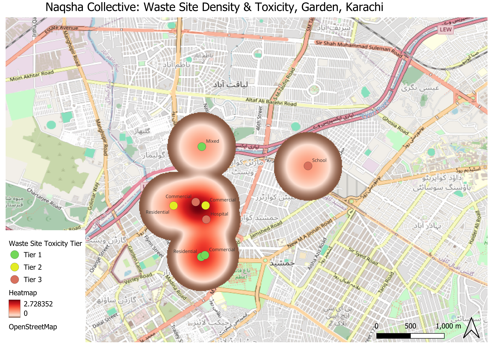
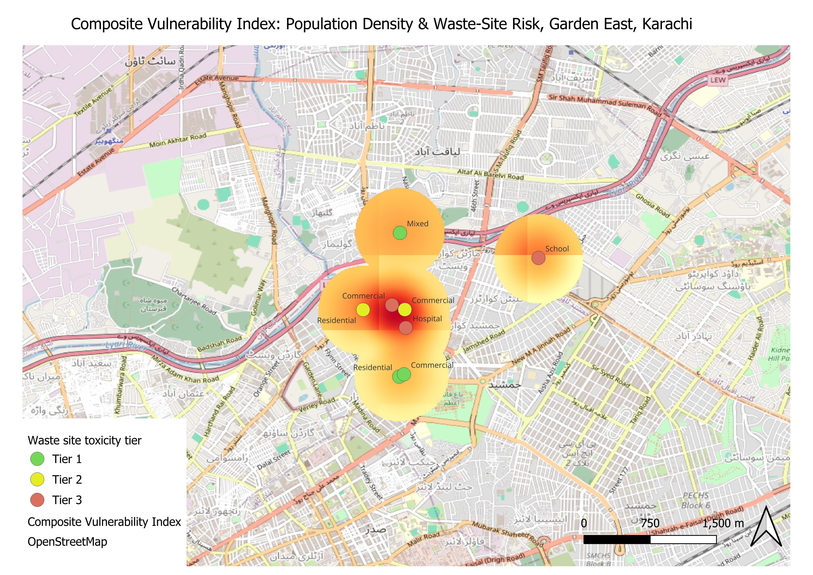

# Karachi-research-portfolio
GIS analysis of informal waste infrastructure in Garden East, Karachi. Includes a toxicity-weighted density map of field-documented waste sites and a composite vulnerability index combining population density with waste-site risk, built as part of independent research with Naqsha Collective.
## Waste Site Toxicity Map

## Composite Vulnerability Index

Full methodology and limitations write-up: [Read here](Methodology_and_Limitations.pdf)
